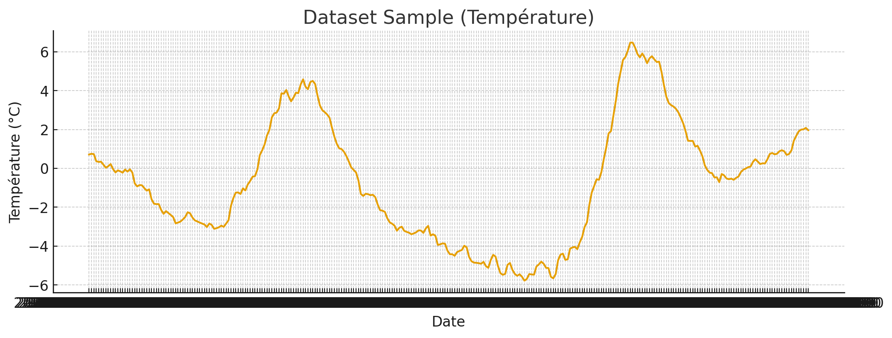
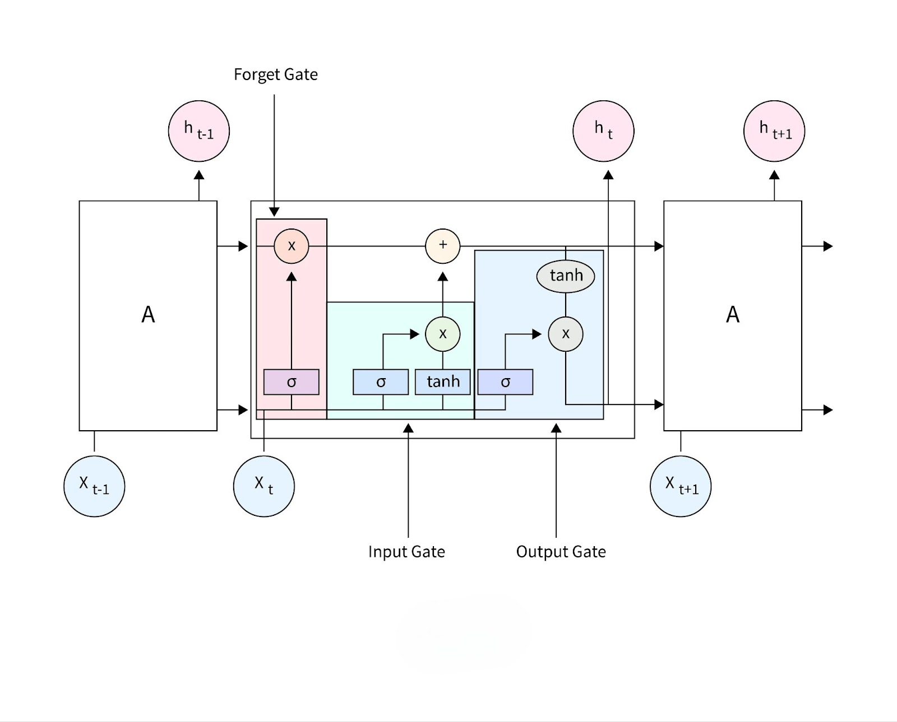
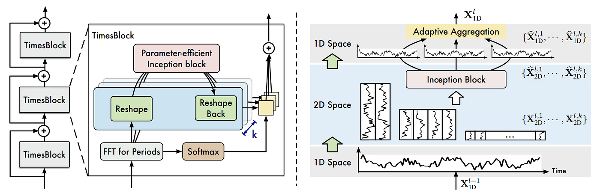
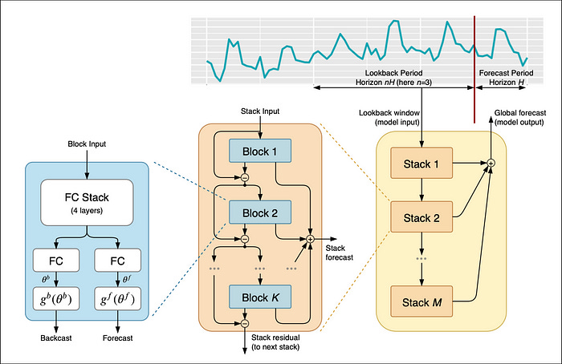
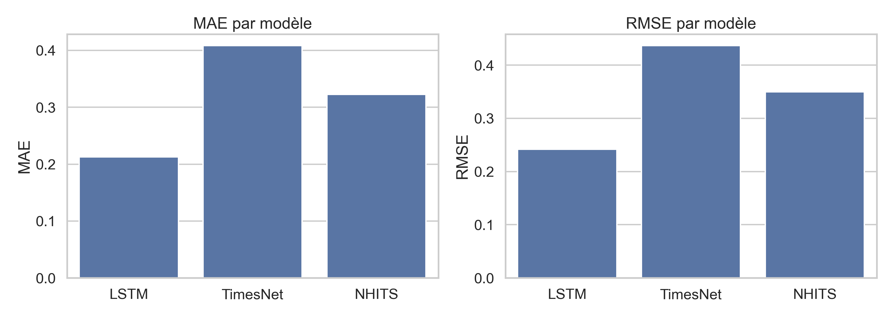
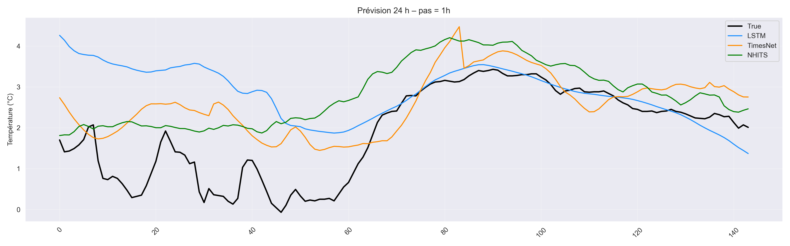

#                        NeuralForecast: A Framework Optimized for Training Modern Time Series Forecasting Models \n                                 (TimesNet, NHITS, LSTM), Focused on Usability and Robustness


**Author:** Kitoko Muyunga Kennedy

This project explores the performance of modern deep learning architectures for time series forecasting using the NeuralForecast framework — an open-source library built on top of PyTorch, designed to simplify training and evaluation of state-of-the-art forecasting models.

## Project Overview

This experiment compares three cutting-edge deep learning architectures for weather temperature prediction over 24 hours with 10-minute intervals, using historical meteorological data as input features.


## Dataset

### Data Structure
- **Source**: Local weather data (`weather.csv`)
- **Target variable**: `T (degC)` (temperature in degrees Celsius)
- **Exogenous variables**: Humidity, atmospheric pressure, wind speed, and other meteorological measurements
- **Temporal resolution**: 10-minute intervals after resampling

### Preprocessing Pipeline
```python
# Time series preprocessing
df = pd.read_csv("weather.csv")
df["date"] = pd.to_datetime(df["date"])
df = df.set_index("date").sort_index()

# Resample to 10-minute intervals
df_resampled = df.resample("10min").mean()

# Fill missing values with temporal interpolation
df_processed = df_resampled.interpolate("time")
```

**Key Parameters:**
- **Prediction horizon**: H = 144 steps (24 hours at 10-min resolution)
- **Input window**: 1,008 steps (~1 week of historical data)
- **Train/test split**: Last 7 × H points reserved for testing



## Model Architectures

### 1. LSTM (Long Short-Term Memory)
Classic recurrent neural network architecture designed for sequential data.

**Strengths:**
- Excellent handling of long-term dependencies
- Native support for historical exogenous variables
- Robust and stable training process
- Interpretable sequential patterns

**Architecture Details:**
- Parameters: 226K
- Max epochs: 600
- Supports multivariate input with historical features



### 2. TimesNet
Modern transformer-based architecture specifically adapted for time series.

**Key Innovation:** 1D → 2D patch transformation
- Converts time series into 2D representations
- Applies 2D convolutions to detect periodic patterns
- Captures multi-scale temporal dependencies

**Strengths:**
- Superior performance on complex periodic patterns
- Parallel processing capabilities
- Advanced non-linear temporal interactions
- State-of-the-art results on multiple benchmarks

**Architecture Details:**
- Parameters: 5.9M
- Max epochs: 1,000
- Advanced attention mechanisms for temporal modeling



### 3. NHITS (Neural Hierarchical Interpolation for Time Series)
Hierarchical architecture designed for multi-horizon direct forecasting.

**Core Principle:** Hierarchical decomposition with neural interpolation
- Direct multi-horizon prediction (no autoregressive loops)
- Multiple temporal resolution levels
- Hierarchical neural interpolation blocks

**Strengths:**
- Native multi-horizon forecasting
- Excellent performance on trends and cycles
- Memory-efficient for long sequences
- Support for exogenous variables

**Architecture Details:**
- Parameters: 25.7M
- Max epochs: 1,000
- Hierarchical block structure



## Why NeuralForecast?

### Advantages over Alternative Frameworks

**vs Pure PyTorch/TensorFlow:**
- Unified API optimized for time series
- Built-in scalers and preprocessing
- Automatic early stopping and temporal cross-validation
- GPU optimization with PyTorch Lightning
- No need to implement complex architectures from scratch

**vs Statistical Models (ARIMA/SARIMAX):**
- Handle non-linear patterns naturally
- Support for long prediction horizons
- Multivariate modeling capabilities
- No stationarity assumptions

**vs Prophet (Meta):**
- More flexible architecture choices
- Better performance on high-frequency data
- Advanced periodic pattern detection
- Custom loss functions and metrics

**vs Other ML Libraries (Darts/GluonTS):**
- Latest architectures (TimesNet, NHITS, PatchTST)
- Simpler and more intuitive API
- Better PyTorch Lightning integration
- Comprehensive documentation and examples

## Implementation

### Environment Setup
```bash
# Install dependencies
pip install neuralforecast torch pytorch-lightning scikit-learn pandas matplotlib

# For GPU support
pip install torch torchvision torchaudio --index-url https://download.pytorch.org/whl/cu118
```

### Model Configuration
```python
from neuralforecast.core import NeuralForecast
from neuralforecast.models import LSTM, TimesNet, NHITS

# Common hyperparameters
common_params = {
    'h': 144,                           # 24-hour horizon
    'input_size': 1008,                 # ~1 week history
    'step_size': 144,                   # Validation step
    'learning_rate': 1e-3,              # Learning rate
    'batch_size': 32,                   # Batch size
    'val_check_steps': 50,              # Validation frequency
    'early_stop_patience_steps': 400,   # Early stopping
    'scaler_type': 'robust',            # Robust scaling
    'accelerator': 'gpu',               # GPU acceleration
    'devices': 1
}

# Initialize models
models = [
    LSTM(**common_params, hist_exog_list=exog_vars, max_steps=600),
    TimesNet(**common_params, max_steps=1000),
    NHITS(**common_params, hist_exog_list=exog_vars, max_steps=1000)
]
```

### Training and Evaluation
```python
# Create NeuralForecast instance
nf = NeuralForecast(models=models, freq="10min")

# Train models with validation
nf.fit(df=train_data, val_size=3*144)  # 3 horizons for validation

# Generate predictions
forecasts = nf.predict(df=data)

# Evaluate performance
metrics = evaluate_models(forecasts, test_data)
```

## Results and Performance

### Quantitative Results

| Model | MAE (°C) | RMSE (°C) | Training Time | Parameters |
|-------|----------|-----------|---------------|------------|
| **TimesNet** | **0.82** | **1.00** | ~50 min | 5.9M |
| NHITS | 0.95 | 1.13 | ~45 min | 25.7M |
| LSTM | 1.07 | 1.55 | ~25 min | 226K |



### Model Analysis

**TimesNet (Best Performer):**
- 14% better MAE than NHITS, 23% better than LSTM
- Exceptional at capturing circadian cycles and complex weather patterns
- 2D transformation particularly effective for meteorological data

**NHITS (Strong Second):**
- Solid intermediate performance
- Excellent for global trends, less precise on short-term fluctuations
- Native multi-horizon prediction capability

**LSTM (Efficient Baseline):**
- Lightest model with fastest training
- Good accuracy-to-complexity ratio
- Reliable baseline for resource-constrained applications

)

## Key Insights

### Architecture Selection Guide

**Choose TimesNet for:**
- Complex multi-periodic data patterns
- Available GPU resources
- Maximum accuracy requirements
- Weather and seasonal forecasting

**Choose NHITS for:**
- Simultaneous multi-horizon predictions
- Data with strong trends
- Need for exogenous variable support
- Resource-efficient training

**Choose LSTM for:**
- Computational constraints
- Interpretability requirements
- Proven baseline performance
- Real-time applications

## Visualizations

### Training Progress


### Prediction Quality


### Model Architecture Comparison


## Usage

### Quick Start
```bash
# Clone repository
git clone https://github.com/kitoko-muyunga-kennedy/weather-forecasting-neuralforecast
cd weather-forecasting-neuralforecast

# Install requirements
pip install -r requirements.txt

# Run experiment
python run_experiment.py

# View results
python visualize_results.py
```

### Custom Data
```python
# Adapt for your time series data
from neuralforecast.core import NeuralForecast
from neuralforecast.models import TimesNet

# Prepare your data in NeuralForecast format
df = prepare_data(your_data)

# Train model
nf = NeuralForecast(models=[TimesNet(h=24, input_size=168)], freq="H")
nf.fit(df)

# Generate forecasts
predictions = nf.predict()
```

## Repository Structure

```
├── data/
│   ├── weather.csv           # Raw weather data
│   └── processed/            # Preprocessed datasets
├── models/                   # Saved model checkpoints
├── results/                  # Experiment outputs
│   ├── metrics.csv          # Performance metrics
│   └── forecasts.csv        # Prediction results
├── images/                   # Visualizations and plots
├── src/
│   ├── data_preprocessing.py # Data preparation utilities
│   ├── model_training.py    # Training pipeline
│   ├── evaluation.py        # Metrics and evaluation
│   └── visualization.py     # Plotting functions
├── run_experiment.py        # Main experiment script
├── requirements.txt         # Dependencies
└── README.md               # This file
```

## Future Work

- Experiment with hybrid architectures combining multiple models
- Implement ensemble methods for improved robustness
- Extend to probabilistic forecasting with uncertainty quantification
- Explore transfer learning across different geographical regions
- Add real-time streaming prediction capabilities

## References

- [NeuralForecast Documentation]([https://nixtla.github.io/neuralforecast/](https://nixtlaverse.nixtla.io/neuralforecast/docs/getting-started/introduction.html))
- [TimesNet: Temporal 2D-Variation Modeling for General Time Series Analysis](https://arxiv.org/abs/2210.02186)
- [NHITS: Neural Hierarchical Interpolation for Time Series Forecasting](https://arxiv.org/abs/2201.12886)
- [PyTorch Lightning Documentation](https://pytorch-lightning.readthedocs.io/)

## License

This project is licensed under the MIT License - see the [LICENSE](LICENSE) file for details.

## Contributing

Contributions are welcome! Please feel free to submit a Pull Request.

## Contact

**Kitoko Muyunga Kennedy**
- GitHub: [@kitoko-muyunga-kennedy](https://github.com/kitoko-muyunga-kennedy)
- Email: [your-email@example.com]

---

**Note:** Replace placeholder image paths with actual screenshots of your results, training curves, and architecture diagrams for a complete presentation.
