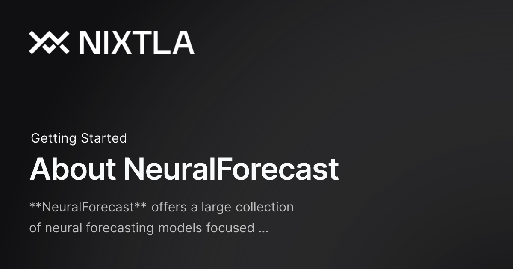

#                        NeuralForecast: A Framework Optimized for Training Modern Time Series Forecasting Models (TimesNet, NHITS, LSTM), Focused on Usability and Robustness


**Author: Kitoko Muyunga Kennedy**

This project explores the performance of modern deep learning architectures for time series forecasting using the NeuralForecast framework — an open-source library built on top of PyTorch, designed to simplify training and evaluation of state-of-the-art forecasting models.

## Project Overview

This project explores the performance of modern deep learning architectures for time series forecasting using the **NeuralForecast**
 framework — an open-source library built on top of PyTorch, designed to simplify training and evaluation of state-of-the-art forecasting models.

We compare the effectiveness of several models including:

**TimesNet**: a Transformer-like architecture tailored for temporal feature extraction

**NHITS**: a hierarchical forecasting model designed for high accuracy on seasonal and trend-heavy data

**LSTM**: the classical recurrent model widely used in earlier forecasting pipelines

All models were trained and evaluated on a real-world multivariate dataset using the same pipeline to ensure fairness.

The experiment demonstrates that modern specialized models like TimesNet significantly outperform traditional methods like LSTM, both in predictive accuracy and robustness. This supports the growing shift from classical RNN-based approaches to attention-based and hierarchical models in industrial time series applications.


## Dataset

### Data Structure
- **Source**: Local weather data (`weather.csv`)
- **Target variable**: `T (degC)` (temperature in degrees Celsius)
- **Exogenous variables**: Humidity, atmospheric pressure, wind speed, and other meteorological measurements
- **Temporal resolution**: 10-minute intervals after resampling

### Preprocessing Pipeline
```python
# Time series preprocessing
df = pd.read_csv("weather.csv")
df["date"] = pd.to_datetime(df["date"])
df = df.set_index("date").sort_index()

# Resample to 10-minute intervals
df_resampled = df.resample("10min").mean()

# Fill missing values with temporal interpolation
df_processed = df_resampled.interpolate("time")
```

**Key Parameters:**
- **Prediction horizon**: H = 144 steps (24 hours at 10-min resolution)
- **Input window**: 1,008 steps (~1 week of historical data)
- **Train/test split**: Last 7 × H points reserved for testing


## Model Architectures

### 1. LSTM (Long Short-Term Memory)
Classic recurrent neural network architecture designed for sequential data.

**Strengths:**
- Excellent handling of long-term dependencies
- Native support for historical exogenous variables
- Robust and stable training process
- Interpretable sequential patterns

**Architecture Details:**
- Parameters: 226K
- Max epochs: 600
- Supports multivariate input with historical features


### 2. TimesNet
Modern transformer-based architecture specifically adapted for time series.

**Key Innovation:** 1D → 2D patch transformation
- Converts time series into 2D representations
- Applies 2D convolutions to detect periodic patterns
- Captures multi-scale temporal dependencies

**Strengths:**
- Superior performance on complex periodic patterns
- Parallel processing capabilities
- Advanced non-linear temporal interactions
- State-of-the-art results on multiple benchmarks

**Architecture Details:**
- Parameters: 5.9M
- Max epochs: 1,000
- Advanced attention mechanisms for temporal modeling


### 3. NHITS (Neural Hierarchical Interpolation for Time Series)
Hierarchical architecture designed for multi-horizon direct forecasting.

**Core Principle:** Hierarchical decomposition with neural interpolation
- Direct multi-horizon prediction (no autoregressive loops)
- Multiple temporal resolution levels
- Hierarchical neural interpolation blocks

**Strengths:**
- Native multi-horizon forecasting
- Excellent performance on trends and cycles
- Memory-efficient for long sequences
- Support for exogenous variables

**Architecture Details:**
- Parameters: 25.7M
- Max epochs: 1,000
- Hierarchical block structure


#  NeuralForecast?
### About NeuralForecast
NeuralForecast offers a large collection of neural forecasting models focused on their usability, and robustness. The models range from classic networks like MLP, RNNs to novel proven contributions like NBEATS, NHITS, TFT and other architectures.



​
### 🎊 Features
Exogenous Variables: Static, historic and future exogenous support.
Forecast Interpretability: Plot trend, seasonality and exogenous NBEATS, NHITS, TFT, ESRNN prediction components.
Probabilistic Forecasting: Simple model adapters for quantile losses and parametric distributions.
Train and Evaluation Losses Scale-dependent, percentage and scale independent errors, and parametric likelihoods.
Automatic Model Selection Parallelized automatic hyperparameter tuning, that efficiently searches best validation configuration.
Simple Interface Unified SKLearn Interface for StatsForecast and MLForecast compatibility.
Model Collection: Out of the box implementation of MLP, LSTM, RNN, TCN, DilatedRNN, NBEATS, NHITS, ESRNN, Informer, TFT, PatchTST, VanillaTransformer, StemGNN and HINT. See the entire collection here.
​
### Why?
There is a shared belief in Neural forecasting methods’ capacity to improve our pipeline’s accuracy and efficiency.
Unfortunately, available implementations and published research are yet to realize neural networks’ potential. They are hard to use and continuously fail to improve over statistical methods while being computationally prohibitive. For this reason, we created NeuralForecast, a library favoring proven accurate and efficient models focusing on their usability.
### Advantages over Alternative Frameworks

**vs Pure PyTorch/TensorFlow:**
- Unified API optimized for time series
- Built-in scalers and preprocessing
- Automatic early stopping and temporal cross-validation
- GPU optimization with PyTorch Lightning
- No need to implement complex architectures from scratch

**vs Statistical Models (ARIMA/SARIMAX):**
- Handle non-linear patterns naturally
- Support for long prediction horizons
- Multivariate modeling capabilities
- No stationarity assumptions

**vs Prophet (Meta):**
- More flexible architecture choices
- Better performance on high-frequency data
- Advanced periodic pattern detection
- Custom loss functions and metrics

**vs Other ML Libraries (Darts/GluonTS):**
- Latest architectures (TimesNet, NHITS, PatchTST)
- Simpler and more intuitive API
- Better PyTorch Lightning integration
- Comprehensive documentation and examples

## Implementation

### Environment Setup
```bash
# Install dependencies
pip install neuralforecast torch pytorch-lightning scikit-learn pandas matplotlib

# For GPU support
pip install torch torchvision torchaudio --index-url https://download.pytorch.org/whl/cu118
```

### Model Configuration
```python
from neuralforecast.core import NeuralForecast
from neuralforecast.models import LSTM, TimesNet, NHITS

# Common hyperparameters
common_params = {
    'h': 144,                           # 24-hour horizon
    'input_size': 1008,                 # ~1 week history
    'step_size': 144,                   # Validation step
    'learning_rate': 1e-3,              # Learning rate
    'batch_size': 32,                   # Batch size
    'val_check_steps': 50,              # Validation frequency
    'early_stop_patience_steps': 400,   # Early stopping
    'scaler_type': 'robust',            # Robust scaling
    'accelerator': 'gpu',               # GPU acceleration
    'devices': 1
}

# Initialize models
models = [
    LSTM(**common_params, hist_exog_list=exog_vars, max_steps=600),
    TimesNet(**common_params, max_steps=1000),
    NHITS(**common_params, hist_exog_list=exog_vars, max_steps=1000)
]
```

### Training and Evaluation
```python
# Create NeuralForecast instance
nf = NeuralForecast(models=models, freq="10min")

# Train models with validation
nf.fit(df=train_data, val_size=3*144)  # 3 horizons for validation

# Generate predictions
forecasts = nf.predict(df=data)

# Evaluate performance
metrics = evaluate_models(forecasts, test_data)
```

## Results and Performance

### Quantitative Results

| Model | MAE (°C) | RMSE (°C) | Training Time | Parameters |
|-------|----------|-----------|---------------|------------|
| **TimesNet** | **0.82** | **1.00** | ~50 min | 5.9M |
| NHITS | 0.95 | 1.13 | ~45 min | 25.7M |
| LSTM | 1.07 | 1.55 | ~25 min | 226K |


### Model Analysis

**TimesNet (Best Performer):**
- 14% better MAE than NHITS, 23% better than LSTM
- Exceptional at capturing circadian cycles and complex weather patterns
- 2D transformation particularly effective for meteorological data

**NHITS (Strong Second):**
- Solid intermediate performance
- Excellent for global trends, less precise on short-term fluctuations
- Native multi-horizon prediction capability

**LSTM (Efficient Baseline):**
- Lightest model with fastest training
- Good accuracy-to-complexity ratio
- Reliable baseline for resource-constrained applications

)

## Key Insights

### Architecture Selection Guide

**Choose TimesNet for:**
- Complex multi-periodic data patterns
- Available GPU resources
- Maximum accuracy requirements
- Weather and seasonal forecasting

**Choose NHITS for:**
- Simultaneous multi-horizon predictions
- Data with strong trends
- Need for exogenous variable support
- Resource-efficient training

**Choose LSTM for:**
- Computational constraints
- Interpretability requirements
- Proven baseline performance
- Real-time applications

## Visualizations

### Training Progress


### Prediction Quality


### Model Architecture Comparison


## Usage

### Quick Start
```bash
# Clone repository
git clone https://github.com/kitoko-muyunga-kennedy/NeuralForecast-A-Framework-Optimized-for-Training-Modern-Time-Series-Forecasting-Models
cd weather-forecasting-neuralforecast

# Install requirements
pip install -r requirements.txt

# Run experiment
python run_experiment.py

# View results
python visualize_results.py
```

### Custom Data
```python
# Adapt for your time series data
import pandas as pd, matplotlib.pyplot as plt, seaborn as sns
from pandas.tseries.frequencies import infer_freq

df = pd.read_csv('weather.csv')
df['date'] = pd.to_datetime(df['date'])
df = df.set_index('date').sort_index()

# interpolation linéaire des NaN éventuels, puis résolution à 10 min
df = df.resample('10min').mean().interpolate('time')

print(df.shape, infer_freq(df.index))   # doit maintenant être (..., '600S')
print(df['T (degC)'].describe().round(2))
plt.figure(figsize=(14,5))
sns.lineplot(data=df['T (degC)'], color="tab:red", lw=1)
plt.title("Température horaire interpolée (10 min)")
plt.ylabel("Température (°C)")
plt.xlabel("Date")
plt.grid(alpha=.3)
plt.show()
```

## Repository Structure

```
├── 
│   weather.csv           # Raw weather data
├── requirements.txt         # Dependencies
└── README.md               # This file
```

## Future Work

- Experiment with hybrid architectures combining multiple models
- Implement ensemble methods for improved robustness
- Extend to probabilistic forecasting with uncertainty quantification
- Explore transfer learning across different geographical regions
- Add real-time streaming prediction capabilities

## References

- [NeuralForecast Documentation]([https://nixtla.github.io/neuralforecast/](https://nixtlaverse.nixtla.io/neuralforecast/docs/getting-started/introduction.html))
- [TimesNet: Temporal 2D-Variation Modeling for General Time Series Analysis](https://arxiv.org/abs/2210.02186)
- [NHITS: Neural Hierarchical Interpolation for Time Series Forecasting](https://arxiv.org/abs/2201.12886)
- [PyTorch Lightning Documentation](https://pytorch-lightning.readthedocs.io/)

## License

This project is licensed under the MIT License - see the [LICENSE](LICENSE) file for details.

## Contributing

Contributions are welcome! Please feel free to submit a Pull Request.

## Contact

**Kitoko Muyunga Kennedy**
- GitHub: [@kitoko-muyunga-kennedy](https://github.com/kitoko-muyunga-kennedy)
- Email: [kitokokennedy13@gmail.com]

---

**Note:** Replace placeholder image paths with actual screenshots of your results, training curves, and architecture diagrams for a complete presentation.
